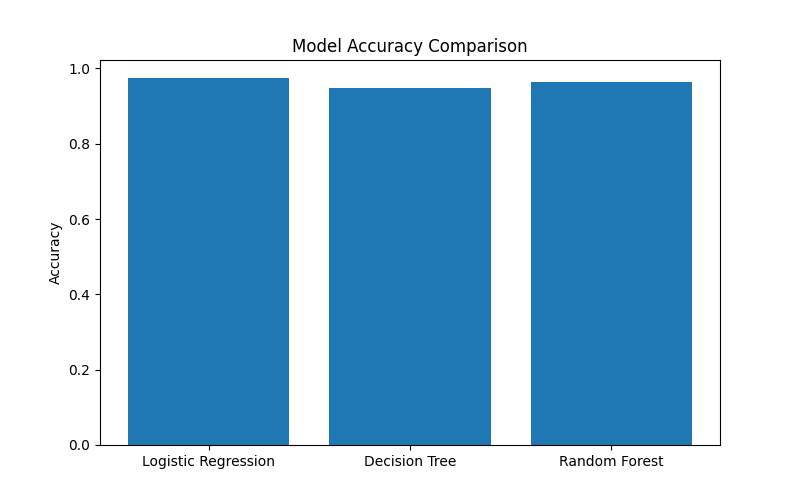
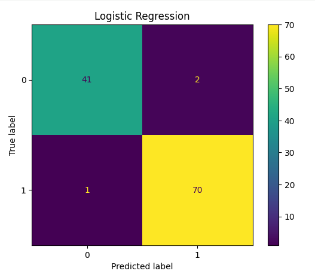
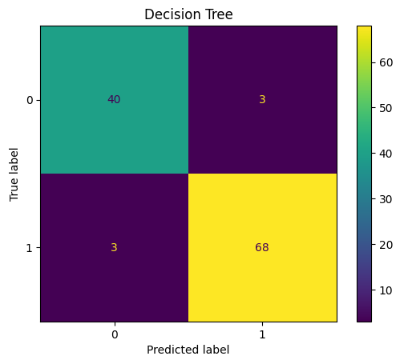
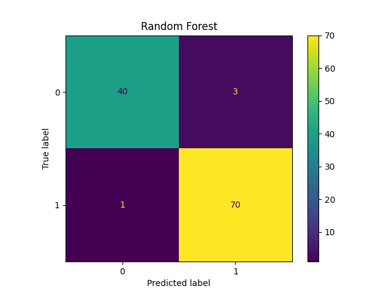
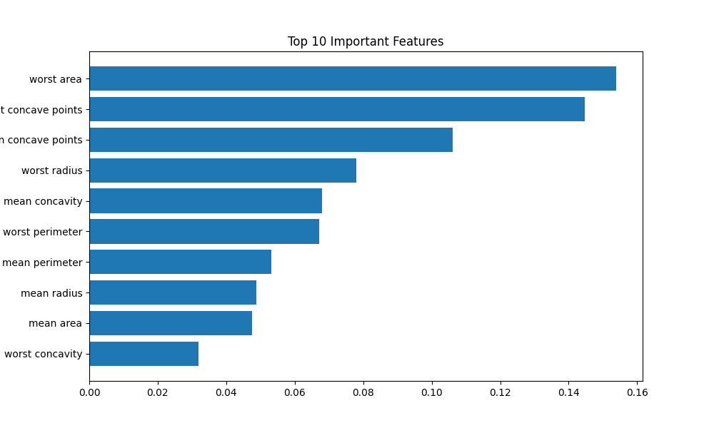

# Breast Cancer Detection using Machine Learning

Breast cancer is one of the most common cancers affecting women worldwide. Early detection plays a crucial role in improving treatment outcomes and survival rates. This project uses Machine Learning techniques to classify breast tumors as **Benign** or **Malignant** using the Wisconsin Breast Cancer Dataset.

The project implements and compares three popular classification algorithms:

- Logistic Regression
- Decision Tree
- Random Forest

The models are evaluated using accuracy scores, confusion matrices, and classification reports to determine the most effective classifier.

---

## Objectives

- Analyze the Breast Cancer Wisconsin Dataset.
- Perform data preprocessing and feature scaling.
- Train multiple machine learning models.
- Compare model performance.
- Visualize classification results.
- Identify important features contributing to predictions.

---

## Dataset

The project uses the **Breast Cancer Wisconsin Diagnostic Dataset** available through Scikit-learn.

### Dataset Characteristics

- Total Samples: 569
- Features: 30
- Classes:
  - Malignant (Cancerous)
  - Benign (Non-Cancerous)

### Features Include

- Mean Radius
- Mean Texture
- Mean Perimeter
- Mean Area
- Mean Smoothness
- Mean Compactness
- Mean Concavity
- Mean Symmetry
- Fractal Dimension
- And more...

---

## Technologies Used

- Python
- Pandas
- NumPy
- Matplotlib
- Scikit-learn
- Jupyter Notebook

---

## Machine Learning Models

### 1. Logistic Regression

A statistical classification algorithm used to predict binary outcomes.

**Advantages**
- Fast training
- Easy to interpret
- Good baseline model

---

### 2. Decision Tree

A tree-based classification model that splits data into decision nodes.

**Advantages**
- Easy visualization
- Handles non-linear relationships

---

### 3. Random Forest

An ensemble learning technique that combines multiple decision trees.

**Advantages**
- High accuracy
- Reduces overfitting
- Robust performance

---

## Project Workflow

### Step 1: Data Loading

Load the Breast Cancer Wisconsin Dataset using Scikit-learn.

### Step 2: Data Exploration

- Check dataset dimensions
- Analyze feature information
- Verify missing values

### Step 3: Data Preprocessing

- Split dataset into training and testing sets
- Apply feature scaling using StandardScaler

### Step 4: Model Training

Train:

- Logistic Regression
- Decision Tree
- Random Forest

### Step 5: Model Evaluation

Evaluate using:

- Accuracy Score
- Confusion Matrix
- Classification Report

### Step 6: Feature Importance Analysis

Analyze the most important features using Random Forest.

---

## Results

| Model | Accuracy |
|---------|---------|
| Logistic Regression | ~97% |
| Decision Tree | ~94-96% |
| Random Forest | ~98% |

> Actual results may vary slightly due to random initialization.

---

## Visualizations

### Accuracy Comparison

Compares the accuracy of all implemented machine learning models.

---

### Confusion Matrix

Displays the classification performance of the trained model.

---

### Feature Importance

Shows the top features contributing to breast cancer prediction.

---

## Performance Metrics

The models are evaluated using:

### Accuracy

Measures the percentage of correctly classified samples.

### Precision

Measures how many predicted positive samples are actually positive.

### Recall

Measures how many actual positive samples are correctly identified.

### F1-Score

Harmonic mean of Precision and Recall.

### Confusion Matrix

Provides detailed information about:

- True Positives
- True Negatives
- False Positives
- False Negatives

---

## Future Improvements

- Hyperparameter Tuning
- Cross Validation
- Support Vector Machine (SVM)
- XGBoost Classifier
- Web Application Deployment using Flask or Streamlit
- Deep Learning Implementation using TensorFlow

---

## Applications

- Medical Diagnosis Support
- Healthcare Analytics
- Cancer Screening Systems
- Clinical Decision Support Systems
- AI-assisted Healthcare Solutions

---

## Conclusion

This project demonstrates the application of Machine Learning in healthcare by developing a breast cancer classification system capable of predicting whether a tumor is benign or malignant. Multiple classification algorithms were compared, and Random Forest achieved the best overall performance, making it a reliable model for breast cancer prediction.
